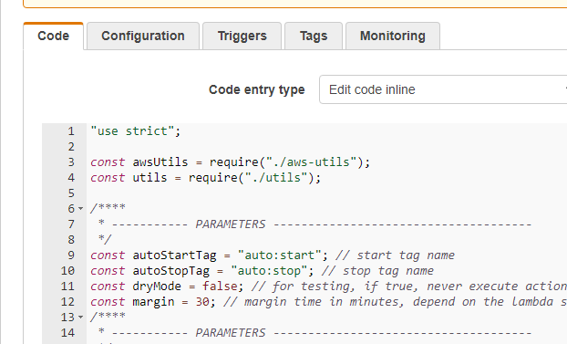

# EC2-AutoStopAndStart

:heavy_dollar_sign: SAVE YOUR MONEY :heavy_dollar_sign:

You can save a lot of money by starting your EC2 instances only when you really need it.
This for a negligible amount, less than $1 a year, needed for the Lambda.
This Node.js application give you the ability to auto stop and start EC2 instances which are tagged with `auto:stop` and `auto:start`.

Inspired by existing python and nodejs applications.In particular, by this one : https://schen1628.wordpress.com/2014/02/04/auto-start-and-stop-your-ec2-instances/

## Main dependencies

* cron-parser : https://www.npmjs.com/package/cron-parser
* aws-sdk : https://www.npmjs.com/package/aws-sdk

## Examples:

  * Auto-stop instance every day at 7pm : `0 19 * * *`
  * Auto-start instance every day at 8:30am : `0 30 8 * * *`

Values of tags are CRON expressions (http://www.cronmaker.com/). Seconds are optionnals.

Never forget that AWS Lambda work in UTC Time.
    
## Installation

1. clone this repository

2. run npm install

3. create a lambda with AWS console (https://eu-west-1.console.aws.amazon.com/lambda/):

* choose "Blank function" blueprint
* configure a trigger :
   * choose CloudWatch Events
   * create a new rule, give him a significant name and description
   * choose rule type: "Schedule expression"
   * insert a schedule expression: rate(5 minutes) or what you need...
   * click "Enable trigger" now or later if you need test


* click "Next"
* Give a name and a description for the lambda
* choose Node,js 6.10
* for function code, choose Upload a .zip file




* create an IAM role (https://console.aws.amazon.com/iam) for executing the lambda, with this strategy:


    ```json
   {
       "Version": "2012-10-17",
       "Statement": [
           {
               "Action": [
                   "ec2:DescribeRegions",
                   "ec2:DescribeInstances",
                   "ec2:StartInstances",
                   "ec2:StopInstances",
                   "ec2:CreateNetworkInterface",
                   "ec2:DeleteNetworkInterface",
                   "ec2:DescribeNetworkInterfaces",
                   "logs:CreateLogGroup",
                   "logs:CreateLogStream",
                   "logs:PutLogEvents"
               ],
               "Effect": "Allow",
               "Resource": "*"
           }
       ]
   }
   ```


 * add a file lambda-config.js

* Create a lambda

* Policy

* Deployment :

Thanks to ThoughtWorksStudios for this great module : https://github.com/ThoughtWorksStudios/node-aws-lambda